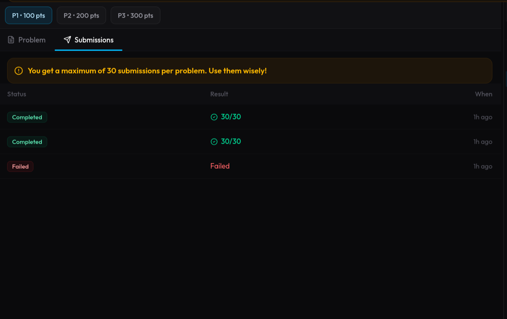
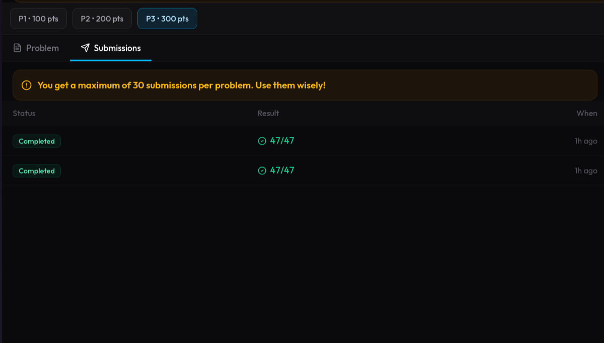
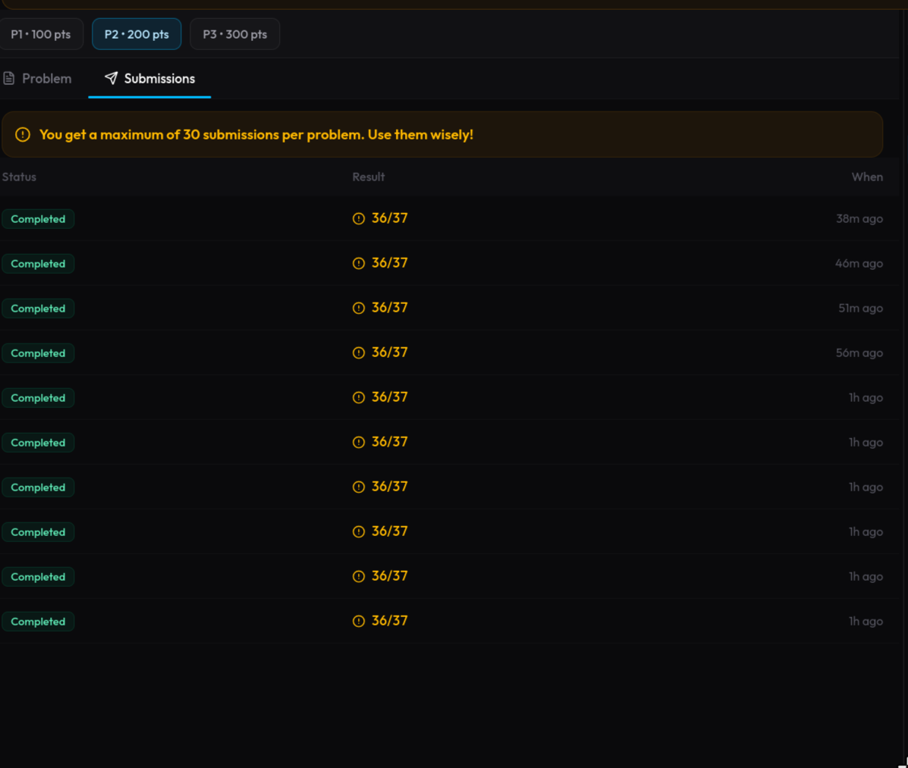

# Solana Contest 1 Solutions

Three Solana backend challenge solutions built with Node.js, TypeScript, Express, and `@solana/web3.js`.

## Test Results

- Overall: `113/114` test cases solved

| Project | Difficulty | Solved |
| --- | --- | --- |
| `address-book` | Easy | `30/30` |
| `multi-sig-vault` | Hard | `47/47` |
| `pda-registry` | Medium | `36/37` |

## Screenshots

<table>
  <tr>
    <td align="center">
      
      <br />
      <strong>Address Book</strong>
    </td>
    <td align="center">
      
      <br />
      <strong>Multi-Sig Vault</strong>
    </td>
    <td align="center">
      
      <br />
      <strong>PDA Registry</strong>
    </td>
  </tr>
</table>

## Project Docs

- [address-book/README.md](./address-book/README.md)
- [multi-sig-vault/README.md](./multi-sig-vault/README.md)
- [pda-registry/README.md](./pda-registry/README.md)

## Run

Each project is standalone. Run one at a time because they all use port `3000`.

```bash
cd <project>
npm install
npm start
```

## License

MIT. See [LICENSE](./LICENSE).
